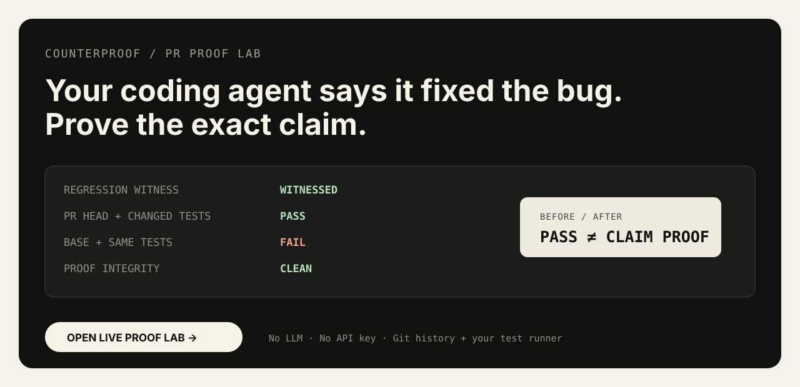
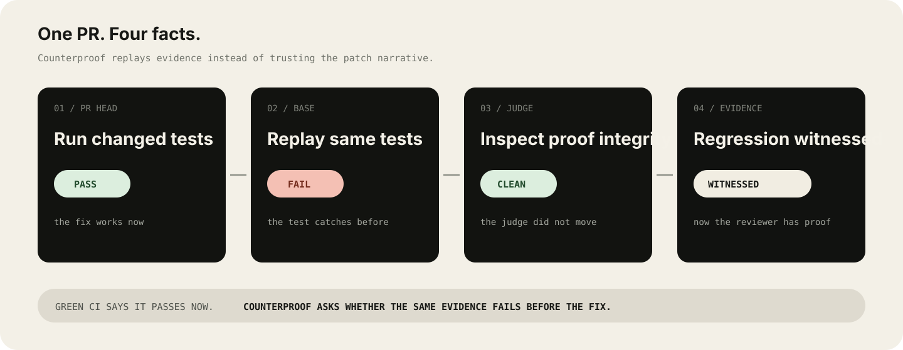

# CounterProof

<div align="center">

## **Your coding agent says it fixed the bug. Prove the exact claim.**

**Replay the same evidence on BASE and HEAD. Keep unproven claims unproven.**

[](https://github.com/hippoley/CounterProof/actions/workflows/ci.yml)
[](https://www.python.org/)
[](LICENSE)


### [**▶ PLAY PROOF LAB**](https://raw.githack.com/hippoley/CounterProof/main/site/standalone.html) · [**? BRING A PR**](https://github.com/hippoley/CounterProof/issues/new?template=reality-probe.yml) · [**⚡ INSTALL**](#30-second-onboarding)

[](https://raw.githack.com/hippoley/CounterProof/main/site/standalone.html)

**One PR · one claim · one evidence set · two commits · one auditable receipt.**

<sub>Not a merge bot. Not another AI reviewer. CounterProof tells you what the submitted evidence establishes — and what it still does not.</sub>

</div>

---

## Tested on real agent PRs

CounterProof is not developed only against fixtures. New proof semantics are tested against public AI-assisted pull requests where a reviewer has a concrete reason not to trust a green check.

**[See the Reality Lab →](docs/REALITY_LAB.md)** · **[Bring an agent PR you don't trust →](https://github.com/hippoley/CounterProof/issues/new?template=reality-probe.yml)** · **[Choose a contribution path →](CONTRIBUTING.md)**

Current field cases include a genuine regression witness, a compiler-failure false positive, a changed-test-harness case, a claim-boundary case, and an oracle-mismatch case.

| Reality signal | What changed because of it |
|---|---|
| **12 public PR cases** | CounterProof gained runner, test-discovery, integrity, and claim-boundary fixes from failures against real repositories. |
| **External reviewer acceptance** | A reviewer asked for the compact claim/evidence matrix, then confirmed the automated artifact preserved the intended review semantics and was usable in review. [Read the exchange →](https://github.com/hippoley/CounterProof/issues/13#issuecomment-5812942595) |
| **First external code contribution** | Oracle provenance and witness-consistency hardening arrived as an external PR and is being reviewed against the product boundary rather than merged on CI alone. [PR #50 →](https://github.com/hippoley/CounterProof/pull/50) |
| **Downstream consumer probe** | A PROVE maintainer preferred attaching CounterProof as ordinary requirement evidence instead of creating a new packet or approval layer. [See the handoff →](examples/handoff/codex-prove.md) |

These are evidence links, not endorsements. CounterProof still treats every new claim as unproven until its evidence earns a stronger status.

---

A green CI run proves that your code passes **now**.

It does **not** prove that the regression test added by the same coding agent would have caught the bug **before** the fix.

CounterProof asks that missing question.

```text
PR code + PR test         → PASS
old code + the same test  → FAIL
test / CI judge unchanged → CLEAN
                             ↓
                     REGRESSION WITNESSED
```

That turns:

> “the agent says it fixed the bug”

into:

> **this exact test behaves differently before and after the fix.**

---

## See it before you install it

### **[Launch the interactive Proof Lab →](https://raw.githack.com/hippoley/CounterProof/main/site/standalone.html)**

The browser experience lets you play with different evidence situations instead of reading another architecture diagram.

```text
REAL REGRESSION
HEAD passes / BASE fails
→ strong before-vs-after evidence

WEAK TEST
HEAD passes / BASE also passes
→ the test does not witness the claimed fix

JUDGE CHANGED
the regression evidence exists
but CI / test machinery changed too
→ reviewer attention required

FULL SUITE
the full suite differs
but the changed test was not isolated
→ weaker evidence than an exact witness
```

The browser scenarios are fixtures. **Real evidence comes from the CLI / GitHub Action.**

---

[](https://raw.githack.com/hippoley/CounterProof/main/site/standalone.html)

> **Click the walkthrough to open the live Proof Lab.**

---

## The fastest useful thing CounterProof does

Take tests changed in a pull request.

Run them on the PR.

Then replay the **same tests** against the pre-change code.

```text
                         PR HEAD        BASE
same changed test          PASS          FAIL
                              \          /
                               \        /
                              WITNESSED
```

If the same test already passes on BASE, CounterProof does not manufacture a success story.

It says the proof is weak.

---

## 30-second onboarding

Install the current repository build:

```bash
python -m pip install "git+https://github.com/hippoley/CounterProof.git"
```

From a feature branch, ask CounterProof for one local evidence readout **before changing repository configuration**:

```bash
counterproof check
```

A strong local result looks like:

```text
Regression       WITNESSED
Evidence scope   SUBMITTED JUDGE
Proof integrity  CLEAN
Strict gate      PASS
Product oracle   UNVERIFIED
```

That means the exact changed-test evidence distinguishes HEAD from BASE and CounterProof did not detect a changed evidence surface. It does **not** mean the PR is correct or ready to merge.

If runner or base detection is unusual, make it explicit:

```bash
counterproof check \
  --base origin/main \
  --test-command "python -m pytest -q {tests}"
```

Want to verify CounterProof itself first? Run:

```bash
counterproof doctor
```

When the local evidence shape looks useful, let CounterProof write an advisory pull-request workflow:

```bash
counterproof init
```

It detects common test runners and writes:

```text
.github/workflows/counterproof.yml
```

Only after you have watched it behave correctly on real pull requests, turn on the two narrow CI gates:

```bash
counterproof init --force --strict
```

Strict mode requires:

```text
exact changed-test witness
+
clean proof-integrity surface
```

It is an evidence gate, not a merge recommendation. If the project only exposes a full-suite command such as `go test ./...` or generic `npm test`, CounterProof refuses `--strict` instead of pretending suite-level evidence is an exact witness.

### Manual Action setup

If you prefer to write the workflow yourself, the root Action is the same Regression Witness path:

```yaml
name: CounterProof

on:
  pull_request:

permissions:
  contents: read
  pull-requests: write

jobs:
  proof:
    runs-on: ubuntu-latest
    steps:
      - uses: actions/checkout@v4
        with:
          ref: ${{ github.event.pull_request.head.sha }}
          fetch-depth: 0

      - uses: actions/setup-python@v5
        with:
          python-version: "3.11"

      # Install your project dependencies first.
      - uses: hippoley/CounterProof@main
        with:
          test-command: "python -m pytest -q {tests}"
          require-witness: "true"
          require-clean-integrity: "true"
```

For the deeper trace / hypothesis / multi-intervention runtime, use the explicit advanced Action:

```yaml
- uses: hippoley/CounterProof/actions/behavior-proof@main
  with:
    trace: path/to/trace.json
    experiment-manifest: path/to/experiments.json
```

CounterProof will:

```text
1. find tests added or modified by the PR
2. run them on PR HEAD
3. create a detached worktree at BASE
4. overlay the PR test/support files
5. run the same evidence on old code
6. classify PRECISE witness vs SUITE DELTA
7. inspect whether the PR changed the judge
8. write one sticky proof comment
```

No hosted service. No API key. No LLM is required for this path.

### When a non-zero exit does not mean “the test failed”

Some build/test wrappers use the same exit code for assertion failures, compilation failures, missing SDKs, setup errors, and other infrastructure problems. In that situation, **do not mint a witness from exit code alone**.

Use the structured result protocol:

```bash
counterproof witness \
  --base origin/main \
  --test-command "python my_test_adapter.py {tests}" \
  --result-protocol json-v1
```

The adapter exits successfully only after it has determined a behavioral result and emits one final line:

```text
COUNTERPROOF_RESULT={"verdict":"pass","metrics":{}}
```

or:

```text
COUNTERPROOF_RESULT={"verdict":"fail","metrics":{}}
```

If the adapter itself exits non-zero, times out, or fails to emit a valid result, CounterProof reports **INCONCLUSIVE**. A compiler error is therefore not silently upgraded into regression evidence.

### When the test already existed but the fixture changed

Changed-test discovery is only the default. Sometimes the reviewer already knows the evidence set: an existing test becomes discriminating because the PR changes a fixture, sample, helper, or other support file.

Declare that evidence explicitly instead of asking CounterProof to infer a dependency graph:

```bash
counterproof witness \
  --base origin/main \
  --test-command "python -m pytest -q {tests}" \
  --test tests/existing_regression_test.py \
  --support-file fixtures/changed_case.json \
  --require-witness
```

CounterProof runs the selected test on HEAD, overlays the declared support file onto BASE, and runs the same test again. The receipt records `test_selection: explicit`. This path came from a real reviewer question where the test file itself was unchanged but the submitted fixture was what made the old behavior fail.

### Share a witness with a reviewer

A machine receipt is useful for automation; a reviewer needs the small set of facts they can check quickly.

```bash
counterproof share-witness REGRESSION_WITNESS.json \
  --integrity-file PROOF_INTEGRITY.json \
  --expected-head <current-pr-head-sha> \
  --source-url https://github.com/owner/repo/pull/123 \
  --runner-url https://github.com/owner/proof/actions/runs/456 \
  --out WITNESS_REVIEW_NOTE.md
```

The integrity file and candidate check are optional. Without them, the command remains backward-compatible with the witness-only reviewer note.

When `--expected-head` is supplied, CounterProof refuses to render the note if the receipt's exact `head_sha` belongs to an older candidate. This prevents a valid old replay from being silently presented as evidence for a newer PR HEAD.

When supplied, the note keeps the two evidence layers separate while putting them on one screen:

- exact HEAD / BASE commits and exit results;
- selected tests and any support files overlaid onto BASE;
- evidence digest and execution links;
- Proof Integrity status plus concrete changed evidence surfaces;
- the scope limit that a regression witness proves the tested before/after delta — not every claimed production cause or merge readiness.

### When one PR contains multiple review claims

A real PR can have one genuinely witnessed regression and several adjacent concerns that its tests do not exercise.

CounterProof's experimental claim matrix keeps those claims separate:

```bash
counterproof claim-matrix examples/claim_matrix/codex-plugin-cc-731.yml
```

The manifest is explicit. CounterProof does **not** use an LLM to invent claims or decide which product behavior is authoritative.

Each row has two mechanical evidence axes:

```text
submitted-test evidence
  WITNESSED / NOT_WITNESSED / UNPROVEN

oracle alignment
  ALIGNED / CONTRADICTED / UNVERIFIED
```

The overall claim is derived conservatively:

```text
WITNESSED + ALIGNED      -> PROVEN
anything + CONTRADICTED  -> CONTRADICTED
WITNESSED + UNVERIFIED   -> WITNESSED (submitted judge)
otherwise                -> UNPROVEN
```

That means a red→green regression can stay useful without silently becoming a product-correctness claim.

The first two acceptance fixtures come directly from public reviewer feedback:

- `examples/claim_matrix/codex-plugin-cc-731.yml` — one witnessed submitted regression, later review concerns still unproven;
- `examples/claim_matrix/claude-code-89404.yml` — product-oracle contradiction stays stronger than an internally green submitted judge.

---

## It also checks whether the PR changed the judge

A passing test is weaker evidence if the same PR also weakens the system that evaluates it.

CounterProof's **Proof Integrity Guard** surfaces changes such as:

```text
deleted test                         → review
new skip / xfail                     → review
continue-on-error: true              → review
pytest ... || true                   → review
pull_request trigger removed         → review
test / coverage / CI config changed  → surface explicitly
```

A finding does **not** mean “malicious PR.”

It means:

> **the evidence surface changed, so the reviewer should not treat the green result as independent evidence.**

---

## Why this matters now

Coding agents are getting very good at producing:

```text
code
+ tests
+ green CI
+ a confident explanation
```

That is useful.

It also creates a new review problem:

> **the system proposing the fix can now help produce the evidence for its own fix.**

CounterProof does not solve that by adding another model.

It adds a deterministic before/after experiment.

```text
Git history
+
your existing test runner
+
the same evidence on both sides
=
something a reviewer can inspect
```

---

## Not another AI reviewer

AI reviewers and CounterProof answer different questions.

| | AI reviewer | CounterProof |
|---|---|---|
| Main question | “Does this diff look suspicious?” | “Does this evidence distinguish before from after?” |
| Core input | code + model context | Git history + tests |
| Main output | suggestions / comments | replayable behavioral evidence |
| LLM required | usually | **no** for PR proof |
| Changed test/CI judge | not the core primitive | **explicitly surfaced** |
| Can refuse a story | model-dependent | **yes — weak/inconclusive evidence stays weak** |

Use CounterProof **next to** Claude Code, Codex, Copilot, Cursor, PR-Agent, or a human engineer.

It does not care who wrote the patch.

---

## Run the playground locally

```bash
python -m pip install "git+https://github.com/hippoley/CounterProof.git"

counterproof demo
```

Open:

```text
http://127.0.0.1:8765
```

Or just use the public version:

### **[Open Live Proof Lab →](https://raw.githack.com/hippoley/CounterProof/main/site/standalone.html)**

---

# The deeper runtime

Regression Witness is the smallest useful entry point.

CounterProof also contains an experimental runtime for **falsifiable agent self-improvement**.

Instead of asking only:

> “what lesson should the agent remember?”

it asks:

> **which explanation survives an experiment, and what evidence earns the right to change behavior?**

```text
RAW TRACE
   ↓
Decision Capsule + Outcome Receipt
   ↓
typed evidence
   ↓
competing hypotheses
   ↓
Probe Contracts
   ↓
same cases × multiple interventions
   ↓
survived / falsified / inconclusive
   ↓
unique survivor?
  ↙           ↘
yes            no
 ↓              ↓
select          remain ambiguous
 ↓
Behavior Proof
 ↓
promotion gate
```

### One-command proof

```bash
counterproof prove examples/traces/tenant_failure.json \
  --replay-manifest examples/replay_suite.json \
  --surface policy \
  --out BEHAVIOR_PROOF.md
```

### Active discrimination

```bash
counterproof discriminate examples/traces/tenant_failure.json \
  --experiment-manifest examples/discrimination_suite.json \
  --surface policy \
  --surface skill \
  --surface prompt \
  --out DISCRIMINATION.md \
  --json-out DISCRIMINATION.json
```

### Guarded evolution

```bash
counterproof evolve examples/traces/tenant_failure.json \
  --experiment-manifest examples/discrimination_suite.json \
  --surface policy \
  --surface skill \
  --surface prompt \
  --out EVOLUTION_REVIEW.md \
  --packet-out EVOLVED_PACKET.json
```

CounterProof is allowed to return ambiguity.

**No winner is better than a fake winner.**

For the deeper architecture, see **[docs/COUNTERPROOF.md](docs/COUNTERPROOF.md)**.

---

## What is real today?

CounterProof keeps a runtime truth table instead of pretending roadmap items are finished.

```bash
counterproof audit
```

The current project includes tested paths for:

```text
Regression Witness
Proof Integrity Guard
raw JSON / JSONL trace ingestion
real subprocess replay
Probe Contracts
multi-intervention discrimination
pre-registered PASS / FAIL predictions
fitness vs diagnostic case semantics
reviewed adapter binding
structured probe results
Proof Receipt + source fingerprints
clean wheel installation
browser interaction smoke tests
```

And it still has clear research gaps:

```text
live agent-framework trace adapters
automatic trustworthy domain-test synthesis
arbitrary world snapshot / restore
generic live mutation executors
shadow / canary rollout
automatic mutation rollback
```

That distinction is intentional.

---

## The design rules

### **Claim nothing you can't replay.**

If the evidence cannot be reproduced, it should not become a stronger claim.

### **A changed judge is part of the change.**

CI and test configuration are evidence-producing machinery.

### **No winner is better than a fake winner.**

Ambiguity is a valid result.

### **Evidence should survive outside the model that produced the patch.**

That is the point.

---

## Repository map

```text
skill_factory/evolution/
├── trace.py
├── replay.py
├── discriminate.py
├── probe_planner.py
├── adapter_binding.py
├── receipt.py
├── capabilities.py
├── report.py
└── cli.py

actions/
└── witness/
    └── action.yml

site/
├── index.html
├── standalone.html
├── app.js
├── styles.css
└── data/

examples/
├── traces/
├── replay/
└── *_suite.json
```

---

## Share it

A 1280×640 social card is included at:

```text
assets/social-preview.svg
```

Use it for the repository social preview, launch posts, HN/X screenshots, or release notes.

---

## Break CounterProof

The highest-value contribution is a **counterexample**.

Can you make CounterProof:

- call weak evidence strong?
- miss a real regression witness?
- trust a changed judge?
- confuse infrastructure failure with behavioral failure?
- produce a proof that looks convincing but is semantically wrong?

If yes, that is not an edge case we want to hide.

**[Open a Counterexample issue →](https://github.com/hippoley/CounterProof/issues/new?template=counterexample.yml)**

A great report gives us:

```text
small reproducible PR
+ expected evidence classification
+ actual CounterProof classification
+ why the difference matters
```

### Other valuable contributions

- runner adapters that preserve before/after semantics;
- real PR fixtures that break assumptions;
- integrity rules with low false-positive cost;
- better discriminating probes;
- adapters for real agent runtimes.

If CounterProof labels weak evidence as strong evidence, **that is a bug**.

---

## License

Apache-2.0.

---

<div align="center">

### **Green is a state. Proof is a relationship between before and after.**

**CounterProof**

*Claim nothing you can't replay.*

### **[▶ Open the Live Proof Lab](https://raw.githack.com/hippoley/CounterProof/main/site/standalone.html)**

</div>
